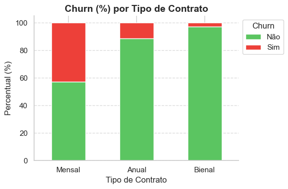

# Análise de Churn - TelecomX

Este projeto apresenta a análise sobre os fatores que influenciam a taxa de churn (cancelamento) dos clientes da TelecomX, com foco em tipo de perfis, tipos de serviço, contratos e formas de pagamento.

---

## 1. Análise do Efeito de Parceiro(a) e Dependentes

Para investigar o impacto da composição familiar na retenção de clientes, cruzamos as variáveis `customer_Partner` e `customer_Dependents` em uma métrica composta chamada `partner_dependents`.

**Insight:**  
Clientes com parceiro(a) e dependentes apresentam a menor taxa de churn, indicando maior estabilidade contratual. Esses perfis são menos propensos a cancelar serviços.

---

## 2. Churn por Nível de Serviço
 

- O plano intermediário concentra a maioria dos cancelamentos, apresentando alto churn apesar do preço próximo ao plano completo.
- Indica baixa percepção de valor por parte dos clientes.

## 3. Churn por Tipo de Contrato

**Insight:** Contratos mais longos reduzem significativamente a rotatividade.

## 4. Churn por Forma de Pagamento

- Cheque eletrônico: alta taxa de churn.  
- Pagamentos automáticos (cartão/débito): maior retenção.
- Clientes que optam por fatura digital tendem a cancelar mais, possivelmente por serem mais exigentes.

## 5. Churn por Período de Contrato

- Clientes que optam pelo plano mensal têm altas chances de evasão.

---

## 6. Conclusões

- A percepção de valor é o principal motor do churn.  
- Perfis familiares com parceiro(a) e dependentes são mais estáveis.  
- Planos intermediários mal posicionados, contratos curtos e formas de pagamento com atrito aumentam o churn.

---

## 7. Recomendações Estratégicas

- **Reposicionar o plano intermediário:** ajustar preço ou entrega para maior competitividade.  
- **Incentivar contratos de longo prazo:** oferecer vantagens reais para fidelização.  
- **Estimular pagamentos automáticos:** com benefícios exclusivos para facilitar a migração.  
- **Campanhas segmentadas:** usar perfil familiar e nível de serviço para direcionar ações de retenção.

---

## 8. Próximos Passos

- Desenvolver modelos preditivos incorporando o perfil familiar (`partner_dependents`).  
- Testar campanhas direcionadas e medir impacto na redução do churn.  
- Avaliar melhorias no plano intermediário para aumentar percepção de valor.

---

Este repositório contém os scripts de análise, relatórios e visualizações que suportam essas conclusões.
